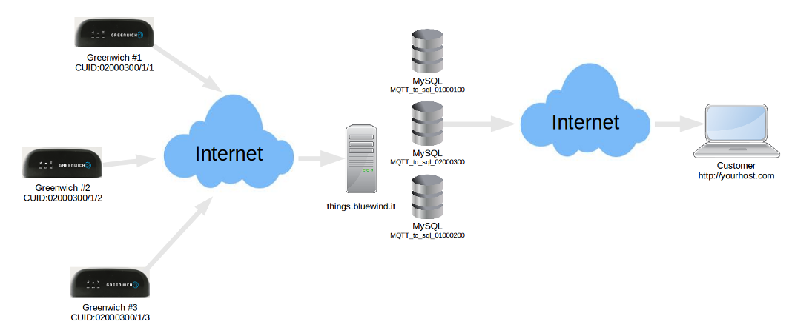

# Access to Greenwich data

## Why are you here?

- you're evaluating or using at least one Greenwich product from Choral;
- you don't have or don't want to use your own public server
  for collecting location data from Greenwich;
- you do want to consume (use) location data from Greenwich
  on your own application, or examine the quality of data during
  an evaluation session;
- you want to be up and running in minutes instead of hours or days,
  without any development effort and without dedicating resources like:
  public IP addresses, servers, bandwidth.

You're in the right place: Greenwich will send it's location
and related data on a cloud platform,
and you will query a very simple database for the records
at any time during or after the data has been produced.
Persistence will last forever, how and when to use the data is up
to your business model.
You don't need to understand how Greenwich talks to the cloud server.

## The short story

Each Greenwich module by default sends location data to a cloud server
hosted at ```http://things.bluewind.it```:
the ***Things*** service.
The cloud server is dimensioned to reliably process millions of messages
from hundreds of thousands modules located anywhere.
The service is not limited to Greenwich and location data;
several other applications in the fields of:

- industrial automation
- smart home
- plant supervision

already rely on ***Things*** for a service known as a *database of things*.

Greenwich (the information producer) sends its data at any time
using secure and managed communication channels.

You (the information consumer) will find organized data
on a very simple database built on the MySQL engine.
You don't need to start or stop acquisition,
and you will not have to log and manage connections time and bandwidth.
You will simply query a remote database and consume rows of data.



Following example shows how to connect and prepare a standard query
for stored messages,
for a given user (console on a Linux based host with MySQL installed,
the same applies to Microsoft Windows).
Data extracted here show some location points and voltage measured
on the internal battery of a Greenwich module:

```
mysql --host=things-srv1.bluewind.it --port=12888 --user=10000014 --password=<secret>

mysql> use mqtt_to_sql_10000014;
mysql> SELECT * FROM `topics` LIMIT 15;

+----+-----------------+
| id | name            |
+----+-----------------+
|  1 | 01600018/1/1/14 |
|  2 | 01600018/1/1/15 |
|  3 | 01600018/1/1/16 |
+----+-----------------+

mysql> SELECT * FROM `messages` WHERE topic_id IN ('14','15') LIMIT 9;

+----+-------------+---------------------+---------------------+----------+
| id | payload     | created_at          | updated_at          | topic_id |
+----+-------------+---------------------+---------------------+----------+
| 14 | B           | 2013-09-23 12:11:02 | 2013-09-23 12:11:02 |       15 |
| 13 | 4.0V        | 2013-09-23 12:11:02 | 2013-09-23 12:11:02 |       14 |
| 33 | 4.3V        | 2013-09-23 12:40:05 | 2013-09-23 12:40:05 |       14 |
| 42 | E           | 2013-09-23 13:25:29 | 2013-09-23 13:25:29 |       15 |
| 50 | 4.3V        | 2013-09-23 13:25:29 | 2013-09-23 13:25:29 |       14 |
+----+-------------+---------------------+---------------------+----------+
```

## More technical details

There's really no need to understand more technical details in order to
start using your new Greenwich module from your simple
example application or host console.
But as soon as you start writing your new killing application
you need to have a deeper understanding of
the data structure and protocols.

### Customer database queries

Queries to database at ```http:\\things-srv1.bluewind.it```
are made possible using an authentication scheme based on
a magic customer-specific code string named ```{CUID}```.
You will start a session from a MySQL console or application using
the simple login data listed below.

### Login to MySQL at Things

|  Item  |  Value  |  Meaning  |
|  :---- |  :----- |  :------- |
|  Host  |  ```things-srv1.bluewind.it``` |  FQDN of the host for database queries |
|  Port  |  ```12888``` |  Port number for database queries |
|  User  |  ```{CUID}``` |  User name for database login |
|  Pwd   |  ```{DB_PWD}``` |  Password for database login |
|  Database |  ```mqtt_to_sql_{CUID}``` |  Database name |

*Please note that any remote login will only reach
the corresponding database with read-only attributes.*

The database reserved to each customer includes a set of
two tables called *topics*  and *messages*.

#### Topics 

|  Field      |  Type          |  Null   |  Key   |  Default   |  Extra           |
|  :-----     |  :---          |  :----  |  :---  |  :-------  |  :-----          |
|  id         |  int(11)       |  NO     |  PRI   |  NULL      |  auto_increment  |
|  name       |  varchar(255)  |  YES    |        |  NULL      |                  |

#### Messages

|  Field      |  Type          |  Null   |  Key   |  Default   |  Extra           |
|  :-----     |  :---          |  :----  |  :---  |  :-------  |  :-----          |
|  id         |  int(11)       |  NO     |  PRI   |  NULL      |  auto_increment  |
|  payload    |  varchar(255)  |  YES    |        |  NULL      |                  |
|  created_at |  datetime      |  NO     |        |  NULL      |                  |
|  updated_at |  datetime      |  NO     |        |  NULL      |                  |
|  topic_id   |  int(11)       |  YES    |        |  NULL      |                  |

### Information generated by Greenwich modules

The server at ```things.bluewind.it```  receives messages from
Greenwich products, sent using an open standard protocol called MQTT.
All messages are stored in a customer-specific *MySQL* database
following the structure defined below.

The MQTT protocol enables to organize information in *messages*
named after *topics*.

### Topics sintax

    {CUID}/1/{deviceid}/{topic}

where:

- ```{CUID}```: Customer / groups of devices assigned CUID
- ```{deviceid}```: *device identifier* usually device-dependent string
- ```{topic}```: see table below for a list of valid topic names

### Valid topics names

|  #     |  Topic  |  Field name  |  Unit  |  Definition  |  Dimension  |
|  :---  |  :----  |  :---------  |  :---  |  :---------  |  :--------  |
|  1     | ```{CUID}/1/{deviceid}/j```    |Json |JSON |JSON string |Variable |
|  2     | ```{CUID}/1/{deviceid}/14```   |Vsupply |V |Battery voltage |4 chars |
|  3     | ```{CUID}/1/{deviceid}/15```   |Indicator E/B |  |Battery (B) operated |1 char |
|  4     | ```{CUID}/1/{deviceid}/16```   |Digital input |  |Bit-coded, LSB = input #1 |1 byte |
|  5     | ```{CUID}/1/{deviceid}/17```   |Digital output |  |Bit-coded, LSB = output #1 |1 byte |
|  6     | ```{CUID}/1/{deviceid}/18```   |Analogue input |  |Bit-coded, LSB = A1 |4 byte |
|  7     | ```{CUID}/1/{deviceid}/90```   |URI generated code |  |  |Max 255 chars |

#### JSON string

The most relevant information string is the JSON representation of the
current GPS and peripheral data. Here the developer can easily extract
position, satellites status, timing and other interesting information
bits that enables building applications.

Standard JSON encoding is in the usual format:

    {key1:"data1", key2:"data2", ...}

with the following keys meaning.

|  Key            |  Field name            |  Unit  |  Definition  |
|  :----          |  :---------            |  :---  |  :---------  |
| ```gpsv```      |GPS Valid data          |        |A = valid, V = invalid |
| ```numsat```    |Satellites              |        |Satellites number |
| ```date```      |GPS date                |        |yymmdd |
| ```time```      |GPS time                |        |hhmmss |
| ```lat```       |Latitude                |deg     |ddmm.mmmmm |
| ```ns```        |Indicator N/S           |        |N = North, S = South |
| ```lon```       |Longitude               |deg     |dddmm.mmmmm |
| ```ew```        |Indicator E/W           |        |E = East, W = West |
| ```cog```       |Course over ground      |deg     |d.dd   |
| ```spd```       |Speed over ground       |knots   |k.kkk  |
| ```alt```       |Altitude sea level      |m       |mmmmmm |
| ```dist```      |Incremental distance    |m       |mmmmmm |
| ```v```         |Battery voltage         |V       |vvvv |
| ```b```         |Power supply indicator  |        |B = battery, E = external supply |
| ```di```        |Digital input status    |        |8 bits, LSB = input #1 |
| ```do```        |Digital output status   |        |8 bits, LSB = output #1 |
| ```ai```        |Analogue input status   |        |4 bytes, LSB = A1 |
| ```uri```       |URI generated code      |        |  |

#### Notes about coordinates

Latitudes and longitudes are computed and sent using this format:

|  Item  |  Format  |  Fields  |  Example  |
|  :---  |  :-----  |  :-----  |  :------  |
|Latitude |  ```ddmm.mmmmm```    |```dd``` =degrees, ```mm.mmmmm``` =minutes with five decimals  |4534.71919 |
|Longitude |  ```dddmm.mmmmm```    |```ddd``` =degrees, ```mm.mmmmm``` =minutes with five decimals  |00911.61224 |

so that as an example this couple of values:

    {lat:"4534.71919", lon:"00911.61224"}

represents:

- 45 degrees, 34.71919 minutes
- 9 degrees, 11.61224 minutes

and can be located on Google Maps with the standard URI query:

    https://maps.google.com/maps?q=45+34.71919,9+11.61224

#### Custom messages injected with HTTP GET

Each Greenwich Module can be linked to one special topic, used by messages sent as a consequence of a coded GET operation on HTTP.

The special topic is built with the syntax

    {CUID}/1/{deviceid}/90

where:

- ```{CUID}```: Customer / groups of devices assigned CUID
- ```{deviceid}```: *device identifier*  usually device-dependent string

The GET operation must be performed against
```http://things.bluewind.it``` with a syntax similar to:

    http://things.bluewind.it/{secret1}/pub/{secret2}?msg={payload}&retain={retainflag}

where:

- ```{secret1}```: Secret assigned to the client (client specific)
- ```{secret2}```: Secret assigned to the Greenwich module (single module specific, linked to {deviceid})
- ```{payload}```: Payload of the published message
- ```{retainflag}```: Determines if a *retain* message type is being published

The two relevant fields ```{secret1}``` and ```{secret2}```
are assigned while delivering the modules.

The meaning of ```{retainflag}```:

|  Value  |  Meaning  |
|  :----  |  :------  |
|  retain=0   |  MQTT Publish without retain    |
|  retain=1   |  MQTT Publish with retain       |
|  any other  |  Not determined / future usage  |

As per MQTT Protocol Specifications a message being published
with *retain* flag set is considered as a default value meaning
that any device (client) subscribing to that message will read
the last published message payload with retain (if any)
as soon as the subscription operation takes place.

Please note that a retained message can be *deleted*
(no longer retained) by publishing to the same topic
with a null message and retain flag set:

    http://things.bluewind.it/{secret1}/pub/{secret2}?msg=&retain=1

This feature can be used for customer-developed applications:

- QR Code reading
- NFC based devices

and others.
