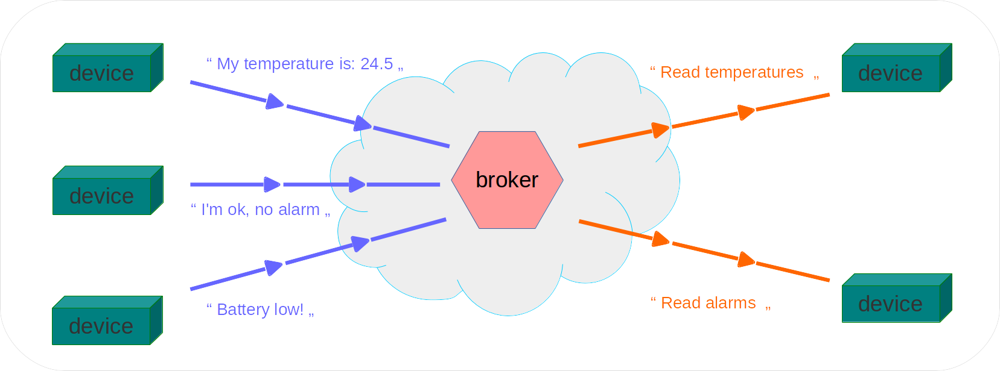

# Things


## Background

Small devices, local computing, visualization services, mobile
applications: when these nodes need to communicate each other using
the Internet they can't be put in direct connection.

This is caused by several factors:

  * firewalls
  * NAT address translations
  * dynamic addresses behind routers
  * special local protocols routed to the Internet

Security concerns make it difficult to imagine a different situation
even when the mentioned constrains can be avoided.


For this reason a messaging protocol paradigm is the only choice
in so many situations. It means that communication between two
or more partners is possible because a server in the middle accepts
and route messages at the low level. Think of a *chat room for devices*.

On top of this any kind of communication model
(a continuous stream of bytes included) can be built and managed.



Having established this communication scheme plenty of added value
options exist that rely exactly on the messaging architecture. To list
only a few:

  * centralized accounting of traffic;
  * mass routing of messages;
  * authorization schemes;
  * backup and recovery;
  * scalable and modular services.
  
## How ***Things*** can help

> ***Things*** is a messaging broker service, enabling communication between
> end points in a secure and managed environment using a standard protocol.

### End points

End points are partners of communication (the flow of messages) in
the form of devices, products, servers, computers designed or
prepared by the customer. They are referred to as *devices* very often
in this document because this is the most common situation where
***Things*** fits very well.

More examples are:

  * a new product for home automation;
  * an existing product for beverages vending with a retrofit design;
  * a server on the cloud collecting messages;
  * an in-house server collecting statistics;
  * an app designed for modern smartphones.
  
All these devices (or services in more general terms) are designed
and deployed by the customer. Bluewind as a provider of technology
offers consultancy, design services, examples if requested.


The architecture of ***Things*** perfectly suits a situation where
end devices have a need for reliable, medium to low volume, secure
communication in the form of an exchange of messages between each other
and with a central service common to all of them.

### Messaging

Communication between the partners is performed by means of *messages*.
Any end point enabled with ***Things*** protocols and services can
very easily send and receive messages; at the same time, all messages
flowing between end points are logged and saved on a private database
residing on the ***Things*** cloud.

Messages are identified assigning them *topics*: a topic is a *name*
for a message, built following defined rules.

### Broker

Enabled end points exchange messages without a direct connection
between each other. Instead, all end points connect directly to the
*broker*: a service (server, daemon) located at ***Things*** that route
messages according to rules and configurations.

The main advantage of this widely adopted architecture is that all
partners in communication need only to know the address and protocol of
one single service, the *broker*.

Devices and servers designed by the customer don't have any need for a
direct reachability on Internet. The only requirement is that they can
start a TCP connection to a public server on the Internet,
and from a logical point of view this makes it possible for all end
points to start sending and receiving messages between each other.

An important side effect of the architecture is that all messages
exchanged are logged and saved in a database, ready to be consumed by
any application that needs to perform actions on them: calculations,
automation, alarms creation, visualization on a web panel, and any other
useful idea.

### Standard protocol

***Things*** speaks the *MQTT* protocol. More details about MQTT are
found in a [dedicated section below](#MQTT Protocol).

***Things*** uses MQTT internally between the services, and externally
between the end points and the broker in most practical situations.
It's very easy to add any other protocol for special needs or
compatibility with existing applications.

When a different protocol is needed Bluewind will create an extension
that translates the information into MQTT messages that conform to the
internal organization of information flow.

### Secure

As [provided by MQTT standard](#Secure transport) all end devices
can (and it's strongly suggested that they do) authenticate and encrypt
communication using TLS 1.2 standard protocols.
A simple *user and password* scheme is also possible.

For situations where a strong authentication and encryption scheme is
not applicable (for example if the communication channel is
expensive and unreliable) Bluewind is able to suggest the best
alternate architectural solution.

### Managed

***Things*** platform is managed internally with automated tasks, and
from the customer point of view with a web administration panel.

The main automated tasks performed inside ***Things*** are:

  * backup of databases
  * daemons status check
  * servers reachability from the Interner
  
Customers can authenticate themselves on a web administration panel and
perform several actions and controls on their own sets of data
and configurations:

  * list, view and export messages exchanged between end points
  * modify secrets
  * check and restart private daemons
  * modify [republishing rules](#Transformations)

## MQTT Protocol

### Description

The [MQ Telemetry Transport (MQTT)][8] protocol is a lightweight
publish/subscribe protocol over TCP/IP for remote devices through
low bandwidth, unreliable or intermittent communications.

MQTT is widely adopted in applications that belong to a
family known as *The Internet of Things*, or *applications where simple
devices and services need to communicate each other without human
interaction*. It has been developed and extensively described in a joint
effort of Corporations like [IBM][9] and others, published and enhanced
by a community of Open Source advocates that includes the
[Eclipse Foundation][10], and standardized by [Oasis][7] that defines
itself as a not-for-profit consortium devoted to promoting
the adoption of Open Source standards and practices in all industries.

### Features

As a general accepted definition contained in the [Oasis documents][11]
the protocol runs over TCP/IP, or over other network protocols
that provide ordered, lossless, bi-directional connections and
its features include:

  * Use of the publish/subscribe message pattern which provides
    one-to-many message distribution and decoupling of applications.
  * Transport of *messages* identified by *topics* organized in a
    hierarchy, much like *folders* in a filesystem.
  * A message can be any *blob* of bytes with a maximum length of 256Mb,
    no restriction applies to its content (binary data is accepted).
    In other words: the messaging transport is agnostic to the content
    of the payload.
  * Three qualities of service for message delivery:
    * "At most once", where messages are delivered according to
      the best efforts of the operating environment.
      Message loss can occur. This level could be used,
      for example, with ambient sensor data where it does
      not matter if an individual reading is lost as the
      next one will be published soon after.
    * "At least once", where messages are assured to arrive
      but duplicates can occur.
    * "Exactly once", where message are assured to arrive
      exactly once. This level could be used, for example,
      with billing systems where duplicate or lost messages
      could lead to incorrect charges being applied.
  * A small transport overhead and protocol exchanges minimised to
    reduce network traffic.
  * A mechanism to notify interested parties when an abnormal
    disconnection occurs.

The messages structure is very simple but the user has no need for
understanding the low level details since plenty of implementations
and examples exist for virtually all useful platforms and languages,
starting from reference libraries found at the
[Eclipse Foundation Paho repositories][10].


### Topics and Messages in practice

Messages flowing through an MQTT compatible broker like ***Things***
are built with two main attributes. We will briefly go through them
here, please check the official documentation for more details.

  * The message *topic*
  * The message *payload*
  
The message *topic* is a sort of a name for the message. It will
identify the message during its life and makes it possible to
categorise messages according to a tree of topic names. Filtering
received messages is very simple using a few rules that apply to
topics, so that each listening node will only receive relevant
classes of messages and not the entire flow.

The message *payload* is the real content for the message. It can be
any blob of bytes, without restriction apart from length (several
megabytes anyway). It's up to the application to interpret bytes
as a meaningful piece of information.


### Secure transport

Messaging solutions for devices are often deployed in hostile
communication environments. Internet by itself is considered highly
hostile and insecure, not to mention local unreliable communication
channels and networks such as radiofrequency links found on home
automation and industrial applications.

When it comes to communication between objects without human
interaction, security is an order of magnitude more difficult to be
achieved because it's often the case that automatic and repeated
processes are very easily interpreted and break by evil
entities. Several examples of such situations are listed here as
references:

  * [breaking a fitness device][12]
  * [breaking a car tracking device][13]
  * [common faults while deploying authentication passwords][14]

In such cases it is advisable to implement proven standards for:

  * *authentication* of Clients by the Server
  * *authentication* of Server by Clients
  * *authorization* of access to Server resources
  * *integrity* of protocols Control Packets and
    application data contained therein
  * *privacy* of protocols Control Packets and
    application data contained therein

Stated in official documentation:

>As a transport protocol, MQTT is concerned only with message
>transmission and it is the implementer’s responsibility to
>provide appropriate security features. This is commonly
>achieved by using TLS (RFC5246).

***Things*** as a company policy uses Open Source implementations of
both the MQTT Broker and TLS v1.2 secure transport, being convinced as a
general rule that publicly available software implementations of
protocols and algorithms are the best approach to an acceptable measure
of privacy and security.

Several different implementation details are available and activated
under request.

## Services description

***Things*** refers to a set of services running
on an array of cloud located servers, offered by Bluewind
with a simple pay as you go contract.

It gives scalable features to subscribed users and is composed of
modules and extensions.


***Things*** enables products designed by customers to send, store,
retrieve and organize messages in a secure and managed environment.
Messages are known inside ***Things*** with a defined syntax and
flow to and from the products by means of a standard default protocol
if available, or any user defined protocol that translates into
its context using extensions.

Modules available on ***Things*** are:

  * messaging broker
  * messages persistent storage
  * messages republishing engine
  * user and devices authentication service
  * web based administration and monitoring

Extensions that can be added to *Things* on request are:

  * protocol translators
  * web data presentation

### How messages get into *Things*

End points enabled for ***Things*** would typically speak the MQTT
protocol; this means that sending a message to the platform is done
by using MQTT and authentication information given when subscribing
to the service.


Each single message is sent to ***Things*** with a very simple
operation from the software point of view. The direct destination of
each message is the broker, while the logical destination can be
any end point that meets three requirements:

  * connects to ***Things*** with the same authentication
    information (belongs to the same account);
  * speaks MQTT;
  * is subscribing to the same message topic in the meaning of MQTT.

In other words: each end point decides that it's interested at listening
to a message topic, and will receive any message being sent
by any other end point named after that topic.

### How messages get out of ***Things***

As already mentioned, messages with a certain topic leave ***Things***
to reach all end points that are interested at that same topic and
speak MQTT. This is the intended behaviour for real time messaging
among devices and applications, one of the foundations of the 
Internet of Things semantic.


Please go through [Persistence](#Persistence) below for a different
delivery of messages.

### Transformations (republishers)

While building services on top of communication between devices it's
often very handy to have the possibility of transforming messages
following defined rules. This happens by republishing selected
messages after having applied filters.

This service is enabled for all customers on the broker. The customer
defines rules on his web administration panel, and messages delivered by
the broker will also be processed by those rules.

Rules are written in a syntax common to the Ruby programming language
using Regular Expressions. They can perform generic string search and
substitution, new topic creation, new message creation from parts
of existing messages.


Transformations are not time related: messages are processed by the
transformation service in realtime while being delivered by the broker
and there is no availability of such functions like delays or triggers.

### Persistence

Messages sent through ***Things*** are optionally processed by a special
service and saved to a database private to the customer.

The database contains reference to topics and messages and each saved
message is timestamped to milliseconds. The customer has an option to
securely connect to the database (MySQL native protocol) and obtain
records by querying with the standard SQL language.


This is the preferred model for business where the customer needs to
build a web presentation service on top of data coming from devices,
and does not want to learn and manage MQTT or any other special
protocol.

Please note that a special topic scheme appies to messages that need
to be saved in the internal database, please go through
[Topics scheme for devices](#Topics scheme for devices) below for
an explanation.


### Topics scheme for devices

#### Numbering scheme for Things nodes: CUID

The *Customer ID* `{CUID}` number is being used as an identification
number for devices connected to the ***Things*** Internet of Things
server. It shall identify a class of devices or a single device and
it's the basis for security, identification and separation of objects.

#### In the context of generation and deployment

`{CUID}` is composed of eight digits (0-9) with the following meaning.

  * `CCCDDDDE`
  * `CCC`:  Customer identification code or `{CIC}`, uniquely assigned
           to each customer
  * `DDDD`: Device or devices group identification number for this
            customer
  * `E`:    Check digit calculated as per EAN-8 rules (barcode)


#### In the context of MQTT

Each MQTT message flowing in the messages broker inside ***Things***
shall meet the following topics naming schema. No restriction applies
to the message payload.

Please note that not all topics relate to messages that are routed
outside of ***Things***: for topics that are not listed to be publicly
routed, internal routes (republishing rules included) apply.

  * `{CUID}/m/{anything}`: messages exchanged with external nodes
  * `{CUID}/0/{anything}`: messages recorded in the internally-accessible database, internal use only
  * `{CUID}/1/{any topics string}`: messages recorded in the customer-accessible database
  
Please note that one single CUID may be assigned to a group of devices;
it will be a good practice to number devices by managing topic values,
as an example:

  * `{CUID}/m/{NNN}/{anything}`: message from `NNN`-th device recorded
                                 in the customer-accessible database
                                 
#### In the context of database query

Queries to database at ***Things*** are possible using an
authentication scheme based again on CUID. The following rules apply
for a connection using any recent *MySQL* client software.

  * Host: `things-srv1.bluewind.it`
  * Port: `12888`
  * User name: `{CUID}`
  * Password: `{assigned}` (available in the ***Things*** user web panel)
  * Database schema: `mqtt_to_sql_{CUID}`

Each login access using `{CUID}` as a user name can reach (only)
a database containing all and only messages that follow the naming
convention explained above, with matching `{CUID}` value in the topic
semantic.

#### Examples

  * Customer name: ACME Co.
  * Assigned `CIC` for ACME Co: `323`
  * Assigned devices group assigned to ACME Co for current delivery/project: `0003`
  * Assigned password for database access: `an2dd612sdADF`

The customer ACME Co is using three devices programmed with the
assigned `{CUID}`. He then sets devices up so that they start sending
messages with a topic scheme like this:

  * `32300031/m/001/temp`
  * `32300031/m/001/v`
  * `32300031/m/002/temp`
  * `32300031/m/002/v`
  * `32300031/m/003/temp`
  * `32300031/m/003/v`

On its user web panel, the customer ACME Co creates a republish rule
that resends messages according to this scheme:

  * Anything received with topic: `32300031/m/#`
  * Please publish again with topic: `32300031/1/#`

The customer ACME Co can query assigned messages in the database
by connecting with a command similar to this:

```bash
shell> mysql                           \
       --host=things-srv1.bluewind.it  \
       --port=12888                    \
       --user=32300031                 \
       --password=an2dd612sdADF        \
       mqtt_to_sql_32300031
```


[1]:https://thingspeak.com/ "ThingSpeak"
[2]:https://xively.com/ "Xively by LogMeIn"
[3]:http://www.cloudmqtt.com/ "CloudMQTT"
[4]:http://2lemetry.com/ "2lemetry"
[5]:https://www.solaircorporate.com/ "Solair"
[6]:http://www.sentilo.io/ "Sentilo"
[7]:https://www.oasis-open.org/committees/tc_home.php?wg_abbrev=mqtt "Oasis MQTT Committee"
[8]:http://mqtt.org/ "MQTT"
[9]:http://www.redbooks.ibm.com/Redbooks.nsf/RedpieceAbstracts/sg248228.html "MQTT at IBM"
[10]:https://eclipse.org/paho/ "MQTT at Eclipse"
[11]:http://docs.oasis-open.org/mqtt/mqtt/v3.1.1/os/mqtt-v3.1.1-os.html "Oasis MQTT Description"
[12]:http://www.evilsocket.net/2015/01/29/nike-fuelband-se-ble-protocol-reversed/ "Breaking a fitness device"
[13]:http://www.forbes.com/sites/thomasbrewster/2015/01/15/researcher-says-progressive-insurance-dongle-totally-insecure/ "Breaking a car tracking device"
[14]:https://crackstation.net/hashing-security.htm "Secure salted passwords"
[15]:http://www.hivemq.com/blog/ "HiveMQ blog series"
[16]:https://www.bbvaopenmind.com/en/internet-of-things-iot-the-third-wave/ "Internet of Things"
[17]:http://bits.blogs.nytimes.com/2013/04/25/a-messenger-for-the-internet-of-things/ "Origin of MQTT"
[18]:http://www.computerworld.com/article/2496621/emerging-technology/the-internet-of-things-gets-a-protocol----it-s-called-mqtt.html "Origin of MQTT"
